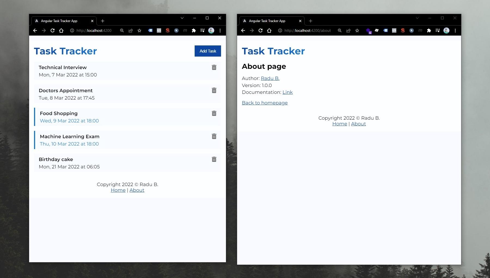

# AngularCrashCourse

This project was generated with [Angular CLI](https://github.com/angular/angular-cli) version 13.2.0. This projects consists of a Tasks App from [Angular Crash Course - Traversy Media - 2h1m](https://www.youtube.com/watch?v=3dHNOWTI7H8).

The complete documentation for this project can be found here: [Study Notes from Angular Crash Course - Traversy Media](https://github.com/radualexandrub/Study/blob/master/Angular/README.md).



<br/>

Contents:

- [AngularCrashCourse](#angularcrashcourse)
  - [Install Dependecies](#install-dependecies)
  - [Run Front-End Development Server](#run-front-end-development-server)
  - [Run Back-End MockUp DATA API](#run-back-end-mockup-data-api)
  - [Code scaffolding](#code-scaffolding)
  - [Build](#build)
  - [Running unit tests](#running-unit-tests)
  - [Running end-to-end tests](#running-end-to-end-tests)
  - [Further help](#further-help)
  - [Run with Docker locally 🚀](#run-with-docker-locally-)
  - [License](#license)

<br/>

## Install Dependecies

Run `npm install`. Make sure you have [Node.js](https://nodejs.org/en/download/) installed (at least version 14/15/16).

```bash
npm install
```

Install Angular Command Line (Angular CLI) globally if it is not already installed (you can check by running `ng --version`).

```bash
npm install -g @angular/cli
```

```
> ng --version

     _                      _                 ____ _     ___
    / \   _ __   __ _ _   _| | __ _ _ __     / ___| |   |_ _|
   / △ \ | '_ \ / _` | | | | |/ _` | '__|   | |   | |    | |
  / ___ \| | | | (_| | |_| | | (_| | |      | |___| |___ | |
 /_/   \_\_| |_|\__, |\__,_|_|\__,_|_|       \____|_____|___|
                |___/

Angular CLI: 13.2.0
Node: 14.16.0
Package Manager: npm 6.14.11
OS: win32 x64

Angular: 13.2.0
... animations, cli, common, compiler, compiler-cli, core, forms
... platform-browser, platform-browser-dynamic, router

Package                         Version
---------------------------------------------------------
@angular-devkit/architect       0.1302.0
@angular-devkit/build-angular   13.2.0
@angular-devkit/core            13.2.0
@angular-devkit/schematics      13.2.0
@schematics/angular             13.2.0
rxjs                            7.5.2
typescript                      4.5.5
```

## Run Front-End Development Server

Run `ng serve --open` for a dev server. Navigate to `http://localhost:4200/`. The app will automatically reload if you change any of the source files.

```bash
ng serve --open
```

## Run Back-End MockUp DATA API

This app is using a dummy pre-made back-end service (REST API), namely **[JSON Server npm - a full fake REST API with zero coding in less than 30 seconds](https://www.npmjs.com/package/json-server)**.

Run in CMD Prompt: `npm run server`. Now we will have our Angular Front-End App on http://localhost:4200/, and Mock REST API Back-end on http://localhost:5000/ (where we can make GET/POST/PUT/DELETE requests just like on a real server made with Django/Express.js/Node.js/Spring-Java/etc).

```bash
npm run server
```

## Code scaffolding

Run `ng generate component component-name` to generate a new component. You can also use `ng generate directive|pipe|service|class|guard|interface|enum|module`.

## Build

Run `ng build` to build the project as a static Application (independent from the Development Environment that is ran by `ng server --open`). The build artifacts will be stored in the `dist/` directory.

## Running unit tests

Run `ng test` to execute the unit tests via [Karma](https://karma-runner.github.io).

## Running end-to-end tests

Run `ng e2e` to execute the end-to-end tests via a platform of your choice. To use this command, you need to first add a package that implements end-to-end testing capabilities.

## Further help

To get more help on the Angular CLI use `ng help` or go check out the [Angular CLI Overview and Command Reference](https://angular.io/cli) page.

## Run with Docker locally 🚀

If you don't want to install Node.js and Angular on your machine, you can run this Application (both front-end app on port 4200 _AND_ back-end JSON Server on port 5000) with [Docker](https://www.docker.com/products/docker-desktop/).

🔵 Note: The `Dockerfile` files were configured to run this App in Development mode (the Angular App will NOT be built and ran as production app in Docker). Therefore, expect the Docker images to be both over 1GB in size (due to npm modules).

- Clone this repo

```bash
git clone https://github.com/radualexandrub/angular-crash-course-traversy angular-app
cd angular-app
```

- Build (and run as containers) the front-end and back-end images via `docker-compose.yml` file (based on `Dockerfile` for front-end and `Dockerfile.json_server` for back-end) with [`docker compose up`](https://docs.docker.com/engine/reference/commandline/compose_up/) command

```bash
docker-compose up

# or -d to supress logs (Detached mode: Run containers in the background)
docker-compose up -d
```

- Open the front-end app (on http://localhost:4200/) and the back-end JSON server (on http://localhost:5000/)

- Play with the app (you can follow the app's logs with [`docker-compose logs -f`](https://docs.docker.com/engine/reference/commandline/compose_logs/))

- Stop and remove both Docker containers

```bash
docker-compose down
```

- Remove both built Docker images

```bash
# View images and their IDs
docker images -a

# Remove both images by their IDs
docker rmi <angular_appImageID>
docker rmi <json_serverImageID>
```
- Show Docker disk usage

```bash
docker system df
```

- (Optional) Remove all Docker data (including Images, Containers, Local Volumes and **Build Cache**)

```bash
docker system prune
```

## License

Copyright (c) 2022 Radu-Alexandru Bulai

Released under [MIT License](./LICENSE.md).
